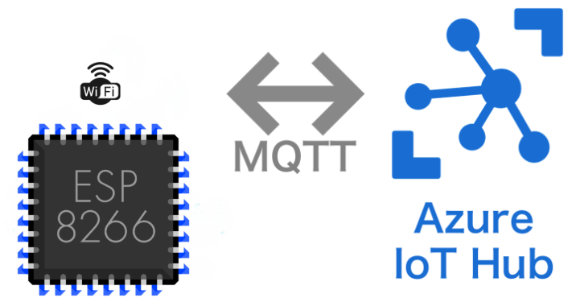
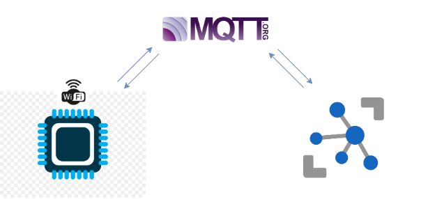

# AZURE-IoT-HUB
## Overview

<p align="center">
  
</p 

**Azure IoT Hub** is a scalable, multi-tenant cloud platform (IoT PaaS) that includes an IoT device registry, data storage, and security. It also provides a service interface to support IoT application development. Learn how Azure IoT Suite helps you securely connect millions of Linux, iOS, Android, Windows, and real-time operating system (RTOS) devices to reliably send telemetry and receive commands from your application back-end in the cloud.IoT Hub supports communications both from the `device to the cloud` and from the `cloud to the device`. IoT Hub supports multiple messaging patterns such as device-to-cloud telemetry, file upload from devices, and request-reply methods to control your devices from the cloud. IoT Hub monitoring helps you maintain the health of your solution by tracking events such as device creation, device failures, and device connections.

## Concept

<p align="center">
  
</p
  
<p><br>
<div align="center">  
  
I have used a `publish` and `subscribe` method for the current demonstration.**ESP8266-12E** module included as a microcontroller for the communication with **IoT Hub**.

</div>

Here we have some points to note:

> - You must need an **Azure IoT Hub** console/account for the demonstration. Details on below section (**Steps**). 
> - This concept works on ESP8266 Arduino Core v2.4.2 and v2.4.0.
> - I have provided documentation for code reference with low-level API concepts. Please go through it for some basic pieces of knowledge.
> - You must have a **device explorer** (`64/32 bit`) according to your system for monitoring the pub-sub messages.Details on below section (**Steps**).  


## Software
* [Arduino IDE](https://www.arduino.cc/en/Main/Software) for Windows, Linux or Mac OS.

## Steps :
 1. **Download** the repo.
 
 2. For those who don't have an **IoT Hub** console/account 😇 download the ***AZURE IOT HUB CREATION*** named pdf from the **DOC** folder and
    carefully read it.
    
 3. Open **LIB** folder from the downloaded repo then extract the `ZIP` file and place the 3 folders into your Arduino local directory folder
    (libraries). 
    Folders(libraries) with name given below :
    
    - AzureIoTHub             (ver : 1.0.34)
    - AzureIoTProtocol_MQTT   (ver : 1.0.34)
    - AzureIoTUtility         (ver : 1.0.34)
    - ArduinoJson		          (ver : 5.13.1)
    
    Here i have used the ***microsoft SDK*** for the demo.
    
    You have an alternate option to download the library from the Arduino library manager. But I am not suggesting that way in this case 👎. 
    
 4. After creating the azure account,the **source code** for our ESP8266 simulation can be found in the **CODE** folder. Open **source code** from the downloaded repo and make
    some changes as mentioned below :
   
   - Open **global.h** and provide your wifi router's `ssid` and `password` :
    
     <p align="center">
        
     </p
  
     <p><br>
     <div align="center">  
       
   - Open **azure.cpp** and provide your primary connection string here :
   
     <p align="center">
        
     </p
  
     <p><br>
     <div align="center"> 
       
     Then try to ***compile*** without error👈. 
     
     ***Warning*** :
     
     strtof issues remains :- 
     > comment `strtof` in Arduino\libraries\AzureIoTHub\src\esp8266/azcpgmspace.cpp . 
    
     You can try both for `DoWork` function in **azure.cpp** : 
     
     ```
       void DoWork(void){
          IoTHubClient_LL_DoWork(iotHubClientHandle);
       }
       
       or
              
       while ((IoTHubClient_LL_GetSendStatus(iotHubClientHandle, &status) == IOTHUB_CLIENT_OK) && (status == IOTHUB_CLIENT_SEND_STATUS_BUSY)){
          IoTHubClient_LL_DoWork(iotHubClientHandle);  
          ThreadAPI_Sleep(100);
       }
     ```

 5. The device explorer initialisation and working is mentioned on document with ***"DEVICE EXPLORER"*** named pdf in **DOC** folder of current repo.Have it and do it😊.You can
    found it on ***TOOLS*** folder(64 bit).
    
## Compatibility
   This library was tested with the NodeMCU V1.0 & ESP8266-12E board. It should also work with other standard ESP8266 that are compatible with the Arduino IDE. ESP8266 core 
   version that I have tested is 2.4.2.
   
## Output
   You can observe it on via `device explore`r and `serial monitor` with baud rate 9600.

<p><br>
<p align="center">
  
</p 
